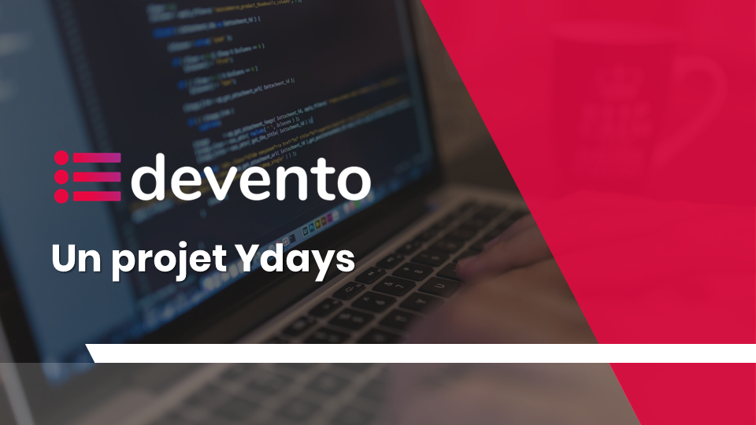

# Devento Project 

> Projet Ydays 2017 Site communautaire sur les langages de développement, vous y trouverez des astuces, mémentos et docs simplifiées. Le contenu sera principalement ajouté par les utilisateurs puis validé par un Administrateur.

## Fonctionnalités

1. Le système d’authentification
 * Connexion
 * Inscription
2. Affichage et édition du profil
 * Affichage
 * Edition
 * Suppression
3. Affichage et édition des posts
 * Affichage
 * Edition
 * Suppression
4. Système d’envoi d’email
 * à l’inscription
 * lorsque le mot de passe est oublié

## Insctructions

L'administrateur par défaut est Admin/password

* La page login (`login.php`) permet de se connecter en tant qu'utilisateur normal
* La page administrateur (`admin.php`) permet de gérer tous les utilisateurs
* Une fois que l'utilisateur a envoyé son post, celui-ci est contrôlé par l'Admin pour le valider

## Contributeurs

* [Benoît DILLIES](https://github.com/BenoitDls)
* [Abdessalam BENHARIRA](https://github.com/Abdessalam98)
* [Alexis NOEL](https://github.com/AlexisNFDV)
* [Aminata SOUMARE NDIYA ](https://github.com/mamy98)
